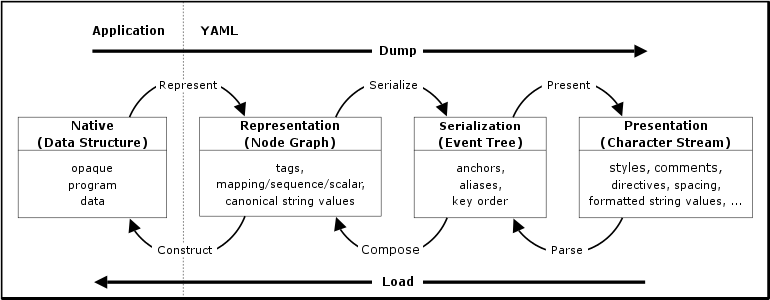

# YAML Intermediate Representation

[](http://yaml.org/spec/1.2/spec.html#Processing)

The current Crystal YAML library produces a quasi-native/intermediate-representation.
The result is native in that YAML Sequences are converted to Array, and YAML Mappings
are converted to Hash, but it is still an intermediate representation because
YAML Scalars remain just Strings.

The YAML Representation library provides a true YAML composer that preserves
information lost when using the current Crystal "parser". This it is an
intermediate representation at a stage of loading just prior to a final
native construction. In particular `tag` information is preserved and
accessible. With this proper intermediate representation this library
can also provide standard native construction.


## Installation

Add this to your application's `shard.yml`:

```yaml
dependencies:
  yaml_rep:
    github: trans/yaml_rep.cr
```


## Usage


```crystal
require "yaml_rep"

yaml = <<-YAML
--- !foo
This is an example.
YAML

doc = YAML.compose(yaml)
doc.tag  #=> "!foo"
```


## Development

If you'd like to help this project improve, familiarize yourself with the
[YAML sepcification](http://yaml.org/spec/1.2/spec.html) and have at it.


## Contributing

1. Fork it ( https://github.com/[your-github-name]/yaml_node_parser/fork )
2. Create your feature branch (git checkout -b my-new-feature)
3. Commit your changes (git commit -am 'Add some feature')
4. Push to the branch (git push origin my-new-feature)
5. Create a new Pull Request


## Contributors

- [trans](https://github.com/trans) trans - creator, maintainer
